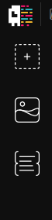

# Documentation

**Quick Tour**

CodeMural is a Generative art tool for html canvas coding. The top bar provodes controls for saving and opening scripts and the button to run your code on the integrated canvas. You will also find the tabs to switch between the edior and canvas views.


Along the side, is the toolbar, which extends the functionality of the program. CodeMural currently includes the following tools:

- Create a new canvas
- Import an image as a canvas
- A Quick-Scripts menu for connecting to the Program's canvas tools 



**Built-in Functions**

CodeMural is set up to integrate with its own built-in canvas. After defining the dimensions and creating one, the canvas can be referenced in your code with ```canvas``` and ```ctx.``` A ```sleep()``` funtion is also included. 