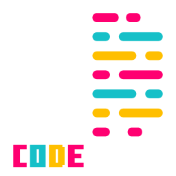

***An HTML Canvas Generative Art Program.***


CodeMural is a JavaScript-based canvas art program. Use the built-in text editor to code visuals to the dynamic canvas. The ```canvas``` and ```ctx``` variables are already defined in the code, as well as a ```sleep``` function. Leaving you to take it from there.

**Version-0.3**
- Rebranded to CodeMural. This decision better reflect the intended use of the tool as a generative art program.
- canvas has been made to be dynamic. define a size in the status bar and create a new canvas, or import an image as a canvas of the source size.

**TODO**
- Saving Code
- Saving images of artwork or textures
- QoL impovements for streamlined coding